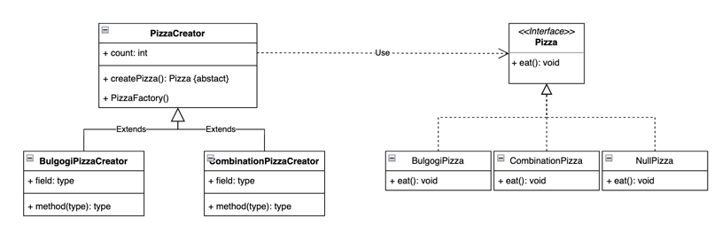

# 팩토리 메서드 패턴
- [설명 보러가기](https://github.com/5onchangwoo/computer-sciences/blob/main/design-pattern/factory_method.md)

## 코드 설명
- 코드 UML  
  
- Pizza 인터페이스를 두고 여러 상품 생성
- Factory에서 피자 총량을 관리할 수 있음.
- 피자를 주문하는 사람은 원하는 PizzaFactory를 호출하기만 하면 됨 -> 캡슐화 (정보 은닉)
- 새로운 피자를 추가하면 Pizza와 Factory만 추가하면 손쉽게 가능 -> 오픈-폐쇄 원칙
- 각 피자와 피자팩토리는 1:1 매칭 -> 단일 책임 원칙
